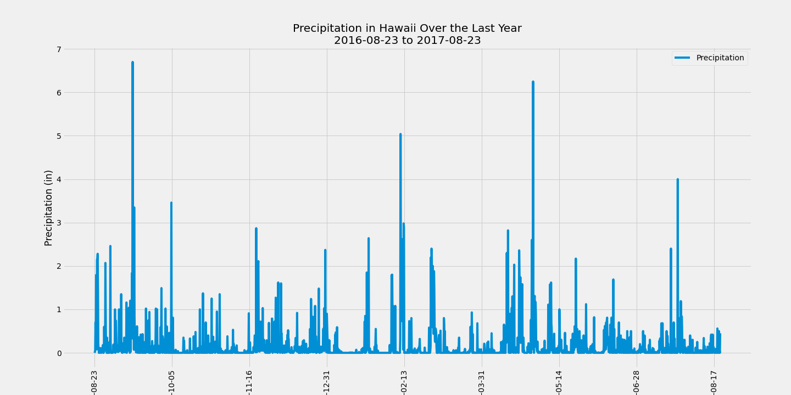
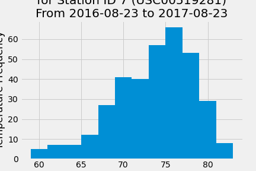

# GT Bootcamp SQLAlchemy Homework: Surf's Up!

## Table of Contents
1. [Introduction](#introduction)
2. [Objectives](#objectives)
3. [Technologies](#technologies)
4. [Files](#files)
5. [Analysis](#analysis)

### Introduction
I'm going on vacation! After all of my hard work these last few weeks, I am treating myself to a holiday in Honolulu, Hawaii. As part of my trip planning, I will be doing some climate analysis on the area, including precipitation and temperature measurements across various weather station locations.

### Objectives
Perform Exploratory Data Analysis in Jupyter Notebook by:
* Plotting precipitation data over last 12 months in a time series
* Printing summary statistics of precipitation data
* Calculating number of stations in dataset
* Finding the most active station by entries
* Calculating lowest, highest, and average temperature for most active station
* Plotting last 12 months of temperature data for most active station in a histogram

Develop a Flask API that has:
* Home page listing all available routes
* Precipitation route containing precipitation values for last year of data with dates as keys
* Stations route containing all station information
* TOBS route containing temperature values for last year of data for most active station
* Dynamic route for start and (optional) end date(s) containing the lowest, highest, and average temperatures over the provided date range

### Technologies
This project uses: 
* Python Version 3.6.13
* Jupyter Notebook Version 6.1.4
* SQLAlchemy Version 1.3.19
* Flask Version 1.1.2

### Files

* [Data Folder](Resources): folder containing all CSVs of data and sqlite database file
* [Climate](climate.ipynb): Jupyter Lab file that performs all exploratory data analysis and creates plots, as described above
* [app.py](app.py): python code used to create Flask application for API

### Analysis

Above is the precipitation time series plot that shows the precipitation values recorded over the last year of data in the dataset.

Above is the temperature histogram plot that shows the frequency of temp values recorded over the last year of data for the most active station (USC00519281).